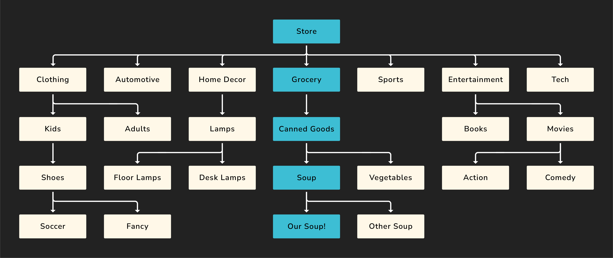

# The File System

## Learning Objective

By the end of this lesson, you'll be able to:

* Analyze and categorize key components of a computer's file system, including root and home directories, and explain their significance using real-world analogies.

## What is the file system?

Before navigating the file system, we should understand what it is. The file system is the organizational structure of a computer.

Just as products in a store are organized by their broadest categories, then divided into sections with aisles full of shelves holding individual products, the files on a computer are organized into directories (also commonly called folders in a GUI).

Imagine you were finding a can of soup at a store. You would start in the store, go to the grocery section, find the canned goods aisle, look for soup, and then find the specific one you want.

Suppose we visualized this:


There is a clear path to our soup! What if we added some other parts of a store to our example?



The path from the store to our specific soup is still highlighted, but we've added some other parts of the store to this diagram. Enough about soup; what does this have to do with a file system?

A file system on a computer follows a lot of the same patterns. Imagine you were finding some music you made on your computer.

You'd start in the *root* directory - `/`. This directory holds all the other directories and files. It's like the store in our example. Then, you'd move into the `Users` directory. From here, move to your specific user directory (the *user root* or *home* directory). Finally, you'd move into your `Music` directory, where you would find your important music!

Another visual for you:


Above, you can see the path to the `beats` file visualized. The word path, or more accurately, *absolute path*, actually has a meaning in this context - it's the unique location for every file or directory in the file system. Each directory in the path is followed by a `/`. The *absolute path* for the `beats` file is:

```plain
/Users/student/Music/beats
```

> 📚 The *root* directory is denoted by a single forward slash (`/`) in Unix-based systems. It is the top-level directory in a file system hierarchy. It is the starting point for the entire file system, and all other directories and files are organized inside it.
>
> The *home* directory is the personal directory assigned to each user on a system. The home directory is the default location where user-specific configuration files, personal documents, and other data are stored. There's a shorthand for this directory: `~`.
>
> The *absolute path* to a file is where the file is located from the perspective of the *root* directory.
