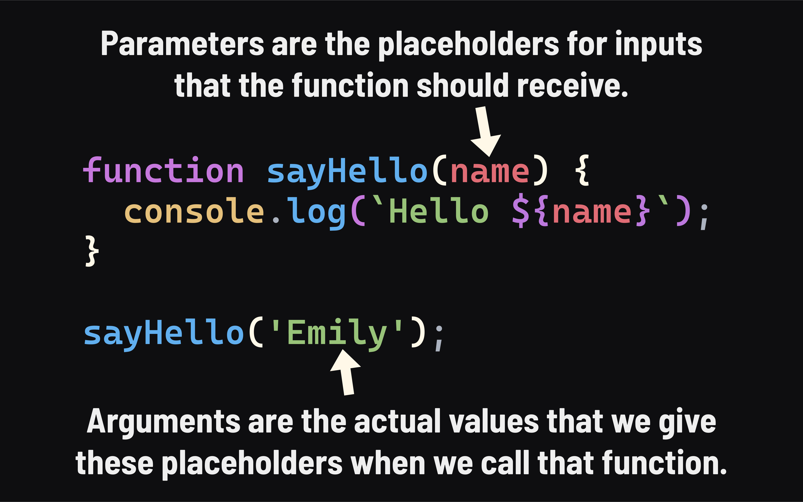

## Using Our Functions

We can make our functions a lot more complicated than just logging statements.

For example, if you were a coffee shop owner, you could create a function to calculate the total cost of a latte:

```js
function latteTotal() {
  const price = 4.50;
  const salesTaxRate = .10;
  const totalAmount = price + (price * salesTaxRate);
  console.log("The total is $" + totalAmount);
}
```

But, what if you wanted to calculate the price of an Americano? Should you write another function called `americanoTotal()` that performs the same calculation with a different price? What about calculating the prices of scones or donuts? Writing all of these functions doesn’t sound like DRY code, does it? 

## Introducing Parameters

We can give the function different information to work with using **parameters**. Instead of doing the same thing with the same information each time, we have the function perform the same tasks on any data we give it.

Remember how we’ve been leaving the `()` after our function’s name empty? It’s time to throw some parameters in there. Here’s how we’d refactor the `latteTotal()` function to work for any product in our coffee shop:

```javascript
function calculateTotal(price, salesTaxRate) {
   const totalAmount = price + (price * salesTaxRate);
   console.log("The total is $" + totalAmount);
}
```

A few things to note:
* There’s nothing special about the words `price` or `salesTaxRate`. We’re using descriptive names to remember what information we’re providing our function. It’s up to you to choose parameter names that make sense for what you’re trying to do.
* We can add multiple parameters separated by commas in the parentheses.

## From Parameters to Arguments

When we invoke a function, we replace parameters with the data we want them to actually use. The data we provide when invoking a function is called an **argument**. 

Here’s how we’d invoke a function with arguments:

```javascript
function calculateTotal(price, salesTaxRate) {
   const totalAmount = price + (price * salesTaxRate);
   console.log("The total is $" + totalAmount);
}

calculateTotal(4.50, .10);
```

In this example, `4.50` corresponds to `price` and `.10` corresponds to `salesTaxRate`. **The order the arguments are written is important**, because it tells JavaScript which parameters they represent.

## Hello, You!

Now that we know about parameters, let’s make a friendly function that can greet anybody by their name. 

* Define a function named `sayHello`.
* It should have one parameter for the `name` of the person we’re greeting.
* It should log the message `Hello _____!`, filling in the `name` in the blank.

<details>
<summary>Solution</summary>



</details>
